# Bridget Riley's Waves: A Harmonic Analysis

Golan Levin, June 2026

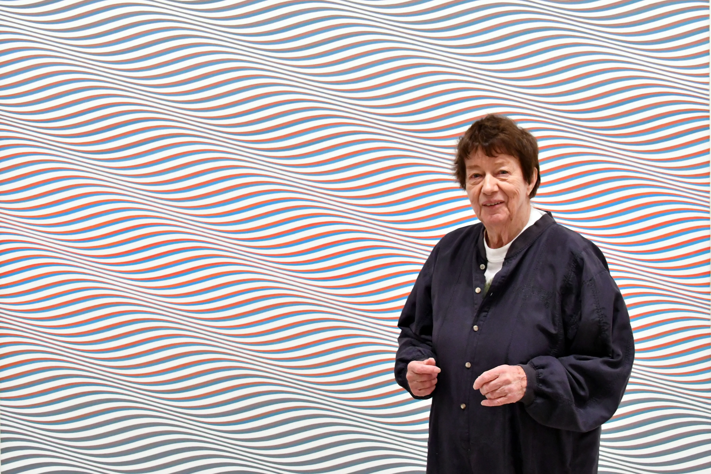

*This study conducts a Fourier analysis of the wave contours in five paintings by Bridget Riley —* **Study for Polarity** *(1964),* **Polarity** *(1964),* **Study for Arrest Series** *(1965),* **Cataract 3** *(1967), and*  **Gala** *(1974) — in order to estimate the amount and character of their harmonic distortion (that is, their deviation from true mathematical sine waves).*

* [Key Findings](#key-findings)
* [The Question of Construction](#the-question-of-construction)
* [Methodology](#methodology)
* [Results](#results)
* [Evidence for Riley's Use of Templates](#evidence-for-rileys-use-of-templates)
* [Analysis of *Polarity* (1964)](#analysis-of-polarity-1964)
* [Citation](#citation)

---

## Key Findings

* **Riley's waves became significantly more sinusoidal over time.** This appears to have been both a design choice as well as the result of increasing precision in fabrication. In particular: the two 1964 *Polarity* works exhibit total harmonic distortion (THD) of approximately 5–6%, reflecting their purposefully shaped, hand-designed waveforms. By contrast, the THD of *Study for Arrest Series* (1965) measures 3.4%, while *Cataract 3* (1967) and *Gala* (1974) achieve just 1.2% and 1.4% respectively. Over the course of a decade, Riley's waves became increasingly pure sine functions, with a precision that increased by roughly a factor of five.
* **By 1967, Riley was producing curves that are extraordinarily close to true mathematical sine waves.** The contours in *Cataract 3* and *Gala* deviate from a perfect sinusoid by little more than 1%, equivalent to the measurement noise floor of the available reproductions. In geometric terms, these contours are *extremely* close to mathematical sine waves.
* **The waves in these paintings were demonstrably traced from common master curves.** Across hundreds of traced contours, the same tiny departures from a perfect sine recur with remarkable consistency. Within each painting, the waves are not merely sinusoidal; they are copies of the same slightly imperfect sinusoid, strongly suggesting the use of a transferred master curve or template. This conclusion was independently confirmed by Bridget Riley Archive director, Dr. Natalia Naish, who described the artist's process as involving the creation of a hardboard (Masonite) template from an initial paper drawing, which was subsequently reused throughout the painting. The exception to this is the small *Study for Arrest Series*, whose waves may have been created without a repeating template. 

---

## The Question of Construction

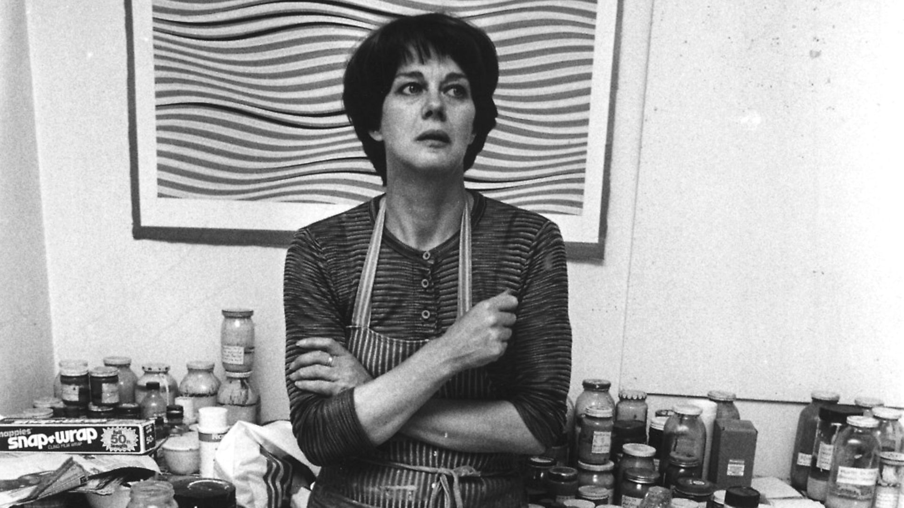

[Bridget Riley](https://en.wikipedia.org/wiki/Bridget_Riley) emerged in the early 1960s as one of the leading figures of Op Art, a movement concerned with the systematic exploration of visual perception. Her paintings use carefully organized geometric forms to generate sensations of movement, vibration, and visual instability. Her wave paintings represent one of the clearest expressions of this project. Although these works are often discussed in perceptual or phenomenological terms, relatively little attention has been paid to the exact geometry of the curves themselves. Are they merely wave-like, or are they specific mathematical functions? The answer turns out to be surprisingly precise.

Fourier analysis of the contours in Riley's wave paintings indicates that they are extraordinarily close approximations to sinusoidal curves rather than merely decorative undulations. Furthermore, the present analysis shows that Riley's waveforms became progressively more sinusoidal between 1964 and 1974, evolving from roughly 5–6% harmonic distortion in the two *Polarity* works to less than 1.6% in *Cataract 3* and *Gala*. Whatever method Riley employed to plot these functions, her geometric precision appears to have increased substantially over time.

Independent corroboration concerning Riley's studio practice comes from correspondence with Dr. Natalia Naish of the Bridget Riley Archive (June 2026). According to Naish, Riley first drew the curve on paper, then transferred it to Masonite (hardboard), where it was cut with a fretsaw and then sanded to create a reusable template. The resulting template could then be shifted and retraced repeatedly across the canvas. This account accords closely with the findings of the present analysis, which indicate that the waves in *Cataract 3* and *Gala* were generated from a common master curve within each painting.

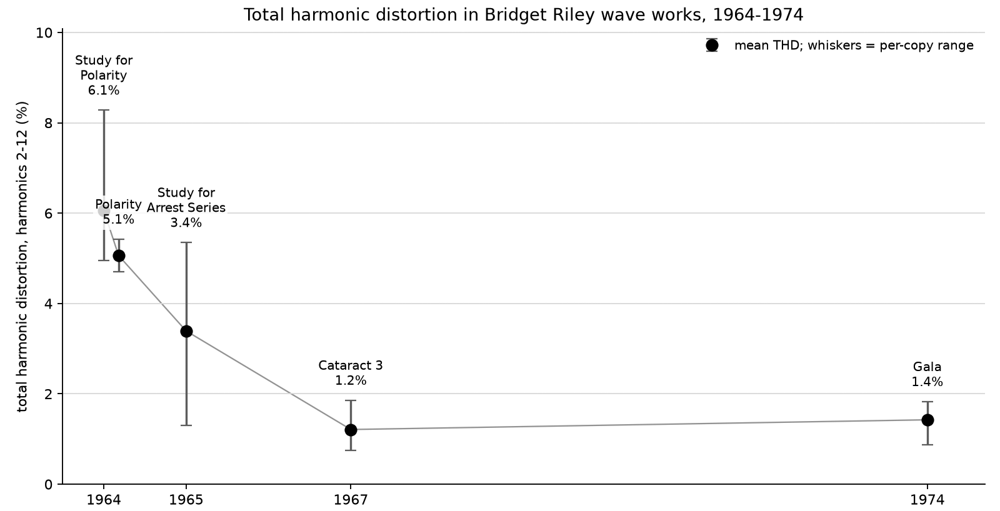

What remains unclear is how Riley generated the initial paper curve. Riley did not use computers or perform calculations (per Dr. Naish), and many of her works in any case predate the advent of affordable scientific calculators in [1972](https://en.wikipedia.org/wiki/HP-35). Nevertheless, several historically plausible drafting methods were available to Riley. One possibility is a simple geometric construction for creating a sine wave using only a compass, protractor, and straightedge, as demonstrated [in this video](https://www.youtube.com/watch?v=V649YJhyb_8):

[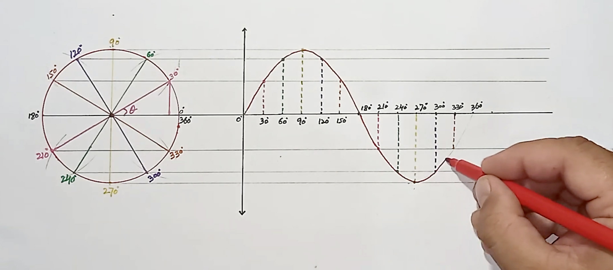](https://www.youtube.com/watch?v=V649YJhyb_8)

Another possibility is the use of trigonometric tables. Before affordable scientific calculators, reference works such as *Chambers's Mathematical Tables*, *Barlow's Tables*, and the *CRC Standard Mathematical Tables* provided pages of precomputed sine and cosine values that could be plotted point-by-point on graph paper. While there is currently no direct evidence that Riley employed any particular drafting procedure, the increasing sinusoidal precision observed across these works suggests that the construction of the initial master curve deserves further historical investigation.

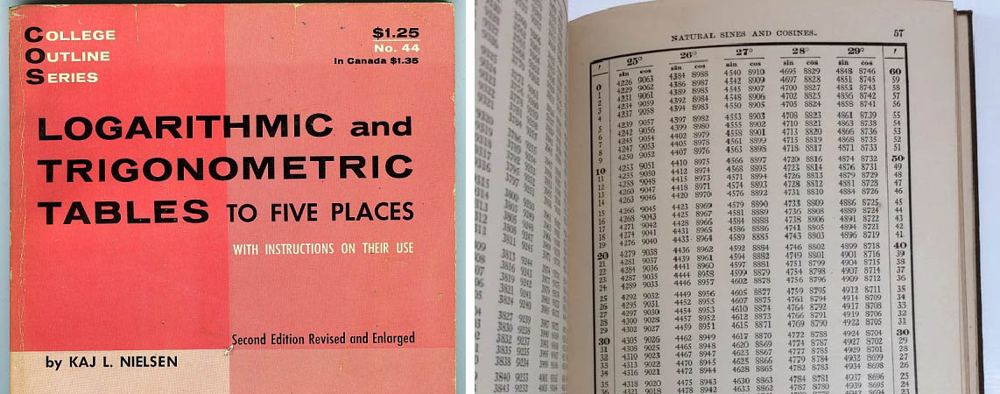

---

## Methodology

Analysis script: [`wave_analysis.py`](wave_analysis.py)
(run with `.venv/bin/python wave_analysis.py`; needs numpy, opencv, scipy,
matplotlib).

In practical terms, the analysis asks three questions:

* How close is each curve to a mathematical sine wave?
* Do repeated curves within a painting share the same tiny imperfections?
* Do different paintings appear to have been constructed in the same way?

The analysis proceeded in five steps:

1. Each painting was converted into a clean black-and-white image, separating the painted wave bands from the background.
2. The edges of every wave band were traced automatically. Each traced edge was treated as one instance of the underlying waveform. This yielded **14 usable wave copies** in *Study for Arrest Series*, **169** in *Cataract 3*, **156** in *Gala*, **116** in *Study for Polarity*, and **255** in *Polarity*.
3. For each traced wave, the best-fitting sine curve was estimated and the remaining deviation from that sine was measured using Fourier analysis. This allowed each curve to be described in terms of its harmonic content (2nd harmonic, 3rd harmonic, etc.).
4. Because the waves occur at different positions and phases within the paintings, all comparisons were made using phase-independent measures of shape. In other words, the analysis ignores where a wave happens to start and focuses only on how its shape differs from a perfect sine.
5. The resulting harmonic signatures were compared both within and between paintings. Harmonics that recur with the same phase across many copies were treated as evidence of a systematic construction feature, while incoherent harmonics were treated as drawing noise, brush wobble, or photographic artifacts.

### Caveats

* These measurements were made from photographic reproductions rather than from the original artworks. Image resolution, lens distortion, canvas texture, lighting, and JPEG compression therefore impose a practical noise floor on the analysis.
* The reported values should be interpreted as measurements of the available reproductions, not as exact measurements of the original painted curves.
* In *Gala*, each traced wave spans only about 2.4 periods, limiting the precision with which very weak higher harmonics can be estimated. This does not materially affect the conclusions presented here.
* Full harmonic coefficient tables are available from the analysis script.

For each painting, the figures below show: (a) the extracted wave contours, (b) all traced waves overlaid and aligned to a common phase, (c) their average deviation from a perfect sine wave, and (d) the measured harmonic spectrum. Green bars indicate harmonics that recur consistently across many copies, while the red dashed line in the Amplitude Spectrum indicates the estimated noise floor.

---

## Results

### *Study for Arrest Series* (1965, gouache on graph paper)

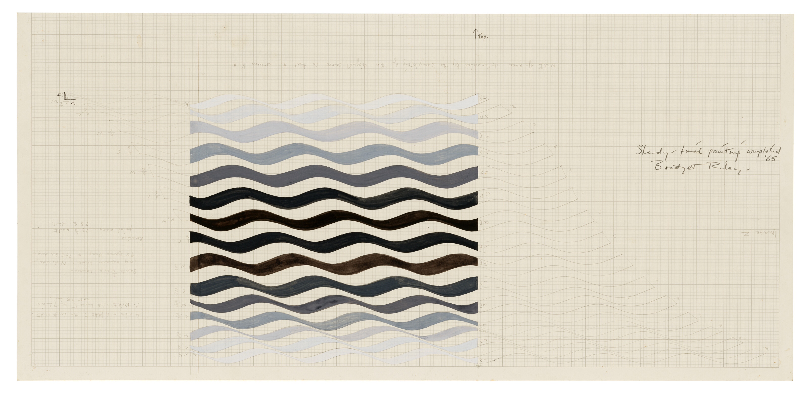

- About this work: [https://www.christies.com/en/lot/lot-6575115](https://www.christies.com/en/lot/lot-6575115)
- BRIDGET RILEY (B. 1931)
- *Study for Arrest Series*, 1965
- Signed, inscribed and dated 'Study. final painting completed '65 Bridget Riley.'
- gouache, graphite and ballpoint pen on graph paper
- 13 ¼ x 28 in. (33.7 x 71.1 cm.)

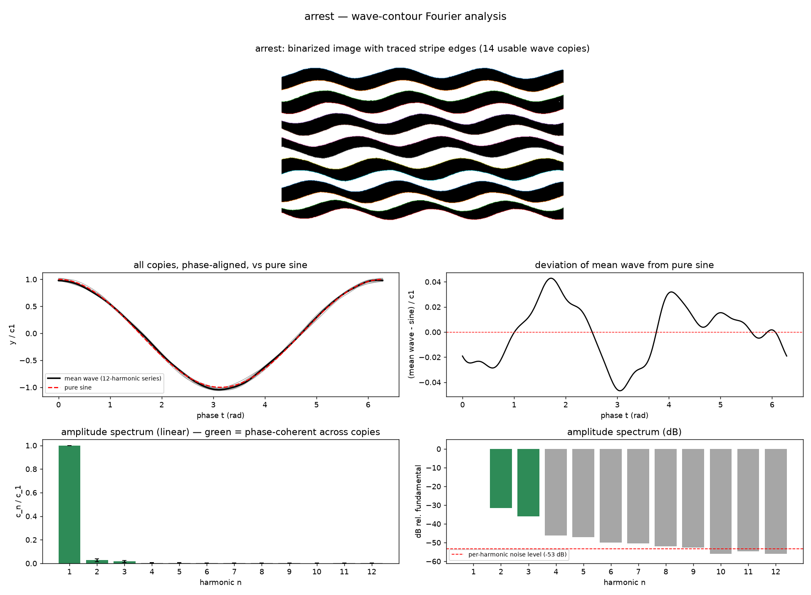

- Mean wavelength λ ≈ 330 px; fundamental amplitude c₁ ≈ 20 px; peak-to-trough
  wave height ≈ 26 mm.
- **THD (harmonics 2–12): 3.4%** (per copy 1.3–5.4%).
- RMS deviation from the best-fit sine: 1.14 px ≈ 0.7 mm = 5.7% of the wave amplitude — but most of that is incoherent brush wobble (the 12-harmonic fit still leaves a 5.1% residual). The *systematic* distortion is the 3.4% THD, dominated by a 2nd harmonic at ψ ≈ −169°: the hand-painted wave is slightly asymmetric, one flank consistently differing from the other.

Phase-coherent harmonics (all others are noise-level, < 0.5%):

| n | cₙ/c₁ | dB rel. fundamental | ψₙ | phase coherence |
|---|-------|-----|------|------|
| 1 | 1.000 | 0 | 0° | 1.00 |
| 2 | 0.027 ± 0.013 | −31.5 | −169° | 0.77 |
| 3 | 0.016 ± 0.008 | −36.1 | −38° | 0.86 |

Painting a sine freehand to within a millimeter RMS is remarkable; the study
being on graph paper suggests Riley plotted the curve point by point.

---

### *Gala* (1974, acrylic on canvas)

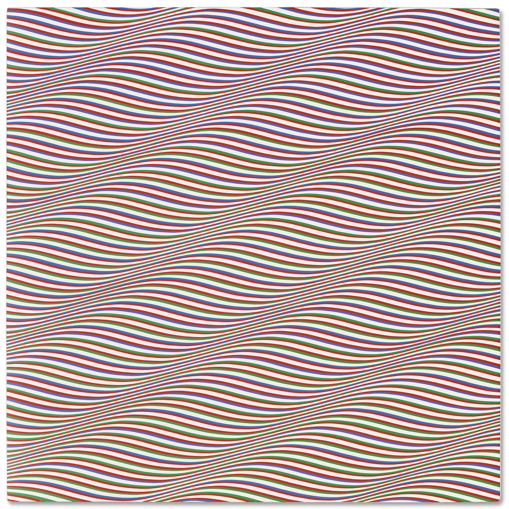

- About this artwork: [https://www.christies.com/en/lot/lot-6362407](https://www.christies.com/en/lot/lot-6362407)
- BRIDGET RILEY, C.H. (B. 1931)
- *Gala*, 1974
- acrylic on canvas
- 62 ¾ x 62 ¾ in. (159.7 x 159.7 cm.)

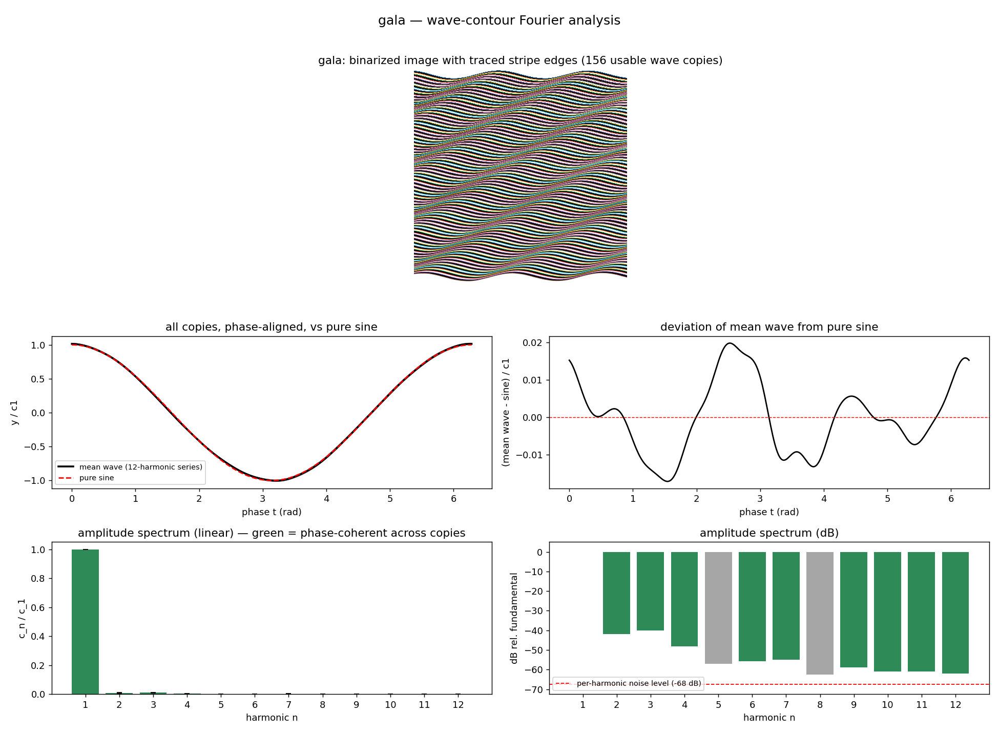

- Mean wavelength λ ≈ 1291 px; fundamental amplitude c₁ ≈ 55 px; peak-to-trough
  wave height ≈ 58 mm.
- **THD (harmonics 2–12): 1.4%** (per copy 0.9–1.8%).
- RMS deviation from a pure sine: 1.07 px = 1.9% of the wave amplitude,
  barely above the tracing noise floor of 1.6%.
- The one unambiguous departure is a 3rd harmonic at 1% of the fundamental
  with phase coherence 0.98 across all 156 copies. At ψ₃ = +63° (with the
  2nd harmonic at −44°), it means the wave consistently *leans* very
  slightly rather than being flattened or peaked. A symmetric construction
  error (e.g. a circular-arc approximation of a sine) would put these phases
  at 0° or 180°, so this looks like a deliberate or template-induced skew,
  repeated identically in every stripe.

Phase-coherent harmonics:

| n | cₙ/c₁ | dB rel. fundamental | ψₙ | phase coherence |
|---|-------|-----|------|------|
| 1 | 1.000 | 0 | 0° | 1.00 |
| 2 | 0.008 ± 0.003 | −42.0 | −44° | 0.91 |
| 3 | 0.010 ± 0.002 | −40.0 | +63° | 0.98 |
| 4 | 0.004 ± 0.002 | −48.3 | −89° | 0.87 |

---

### *Cataract 3* (1967, polyvinyl acetate on canvas)

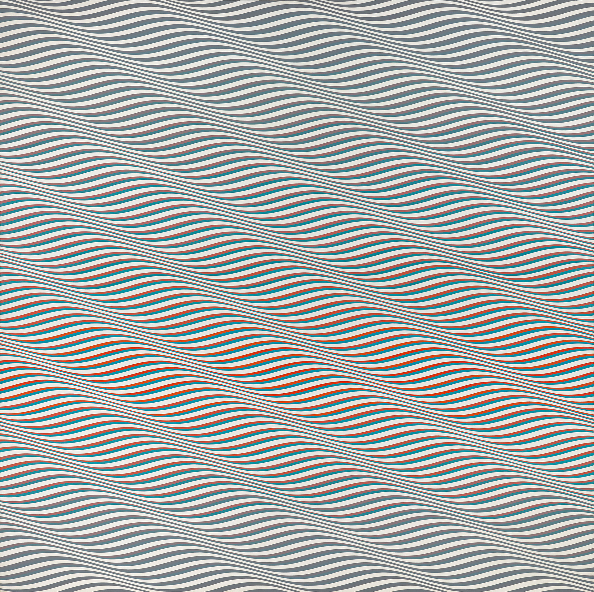

- About this artwork: [https://bridget-riley.publications.britishart.yale.edu/catalogue/32/](https://bridget-riley.publications.britishart.yale.edu/catalogue/32/)
- BRIDGET RILEY (B. 1931)
- *Cataract 3*, 1967
- polyvinyl acetate on canvas
- 87 ⅜ × 87 ¾ in. (221.9 × 222.9 cm)
- British Council Collection
- High-resolution image: [Yale catalogue figure C32](https://bridget-riley.publications.britishart.yale.edu/img/figures/C32.jpg)

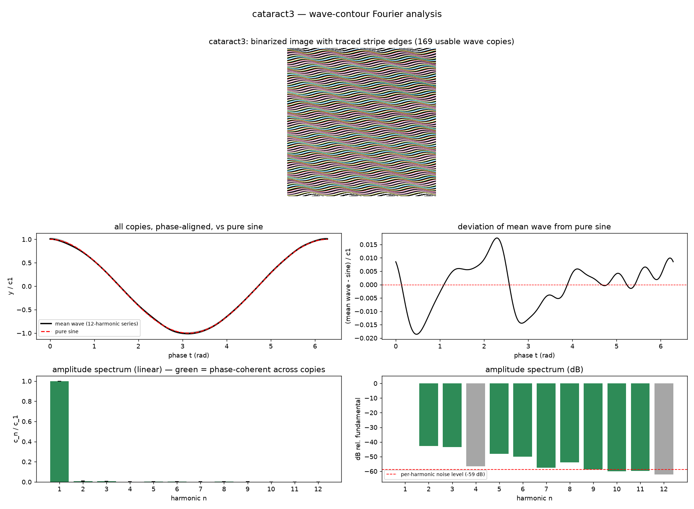

- Mean wavelength λ ≈ 482 px (≈ 56 cm on the canvas); fundamental amplitude
  c₁ ≈ 22 px; peak-to-trough wave height ≈ 50 mm. Each stripe edge spans
  exactly 4.0 periods.
- **THD (harmonics 2–12): 1.2%** (per copy 0.8–1.9%) — the most accurate
  sine of the three works, despite predating *Gala* by seven years.
- RMS deviation from a pure sine: 0.79 px ≈ 0.9 mm = 3.7% of the wave
  amplitude, essentially at the tracing noise floor (3.6%): the systematic
  deviation is limited by the reproduction quality, not by Riley's hand.
- The faint residual harmonics (all < 0.7%) are phase-coherent across all
  169 copies — every stripe departs from a sine in the *same* way,
  indicating a single master curve (template) reproduced across
  the canvas with sub-millimeter fidelity.

Phase-coherent harmonics (all others are noise-level):

| n | cₙ/c₁ | dB rel. fundamental | ψₙ | phase coherence |
|---|-------|-----|------|------|
| 1 | 1.000 | 0 | 0° | 1.00 |
| 2 | 0.007 ± 0.002 | −42.7 | −138° | 0.93 |
| 3 | 0.007 ± 0.002 | −43.4 | −37° | 0.97 |
| 5 | 0.004 ± 0.001 | −48.0 | −45° | 0.96 |
| 6 | 0.003 ± 0.001 | −50.1 | +32° | 0.95 |
| 8 | 0.002 ± 0.001 | −54.0 | +28° | 0.93 |

---

## Evidence for Riley's Use of Templates

**Key finding:** *Cataract 3* and *Gala* appear to have been constructed from a single master curve that was transferred repeatedly across each painting. Each painting used its own master curve.

The preceding analyses show that Riley's waves are highly sinusoidal. A separate question is whether the repeated waves within a given painting were generated independently or copied from a common source.

To investigate this, the residual deviations from a perfect sine wave were compared across all traced copies within each painting. If two waves were traced from the same template, they should depart from a perfect sine in the same places and by the same amounts. If they were drawn independently, their small imperfections should be largely unrelated.

Several conclusions emerge:

* **The waves in *Cataract 3* and *Gala* are copies of the same slightly imperfect waveform.** Nearly every pair of waves shares the same tiny departures from a perfect sine. The curves are not merely similar; they carry the same geometric fingerprint. This is strong evidence that a single master curve was transferred repeatedly across each canvas.
* **The hand-painted *Study for Arrest Series* behaves differently.** The waves share a common structure, but their deviations are much more varied. Rather than reproducing a single template with high fidelity, each copy appears to incorporate a larger amount of individual drawing variation.
* **The archival record independently confirms this interpretation.** In personal correspondence (June 2026), Dr. Natalia Naish of the Bridget Riley Archive described Riley's process as involving an initial drawing on paper that was transferred to Masonite, cut into a reusable template, and then repeatedly shifted across the composition. The statistical evidence presented here is therefore consistent with the documented studio process.
* **Different paintings used different master curves.** Although *Cataract 3* and *Gala* were both constructed through template-based repetition, their residual harmonic signatures are unrelated. The two paintings therefore appear to have been created with different templates rather than the same physical master curve.

Taken together, these findings suggest a two-stage process: first, the creation of a carefully drafted master waveform; second, the repeated transfer of that waveform throughout the composition.

### Methodology

*Within a given painting, are the repeated waves actually copies of the same curve, or does each wave depart from a sine in its own unique way?* To answer this, I first removed the dominant sine component from every traced wave, leaving only its residual deviation profile — the tiny departures that make the curve slightly different from a mathematically perfect sine. These residual profiles were phase-aligned and normalized by amplitude so that only differences in shape remained. Every profile was then compared against every other profile ("cross-correlated") using Pearson correlation, producing an N×N similarity matrix for each painting.

Under this analysis, two waves traced from the same template should exhibit the same small departures from a perfect sine and therefore correlate strongly (`r ≈ 1`). Waves whose deviations arise primarily from independent drawing variation should correlate weakly (`r ≈ 0`). Because Pearson's `r` is insensitive to overall scale and offset, the results are directly comparable across paintings.

In the diagram below, the upper row shows the correlation matrices for each painting. Each pixel represents the similarity between a pair of wave copies: dark red indicates nearly identical deviation profiles, white indicates little relationship, and blue indicates opposite deviations. The lower plot shows the distribution of all pairwise correlations for each painting.

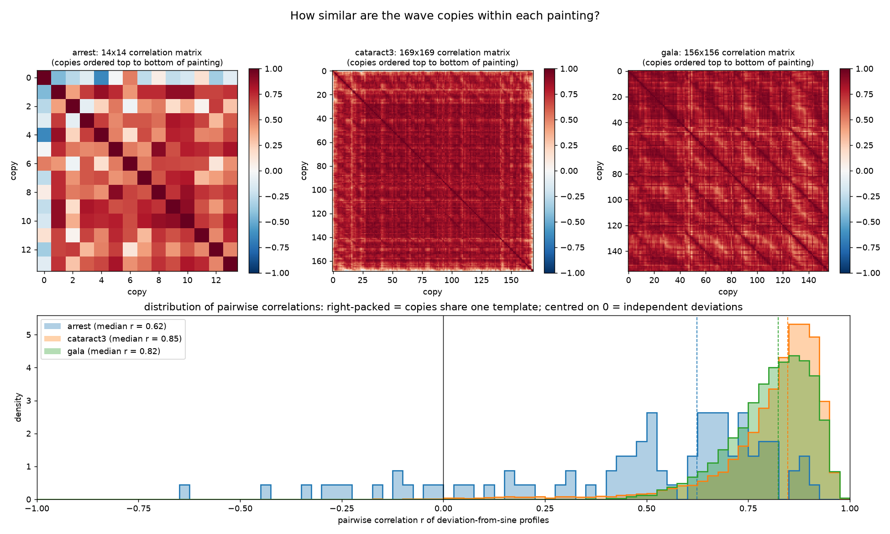

| painting | copies | pairs | median r | IQR | pairs with r > 0.5 |
|---|---|---|---|---|---|
| *Study for Arrest Series* | 14 | 91 | 0.62 | 0.38 – 0.72 | 62% |
| *Cataract 3* | 169 | 14,196 | 0.85 | 0.77 – 0.89 | 96% |
| *Gala* | 156 | 12,090 | 0.82 | 0.75 – 0.88 | 99% |
| *Study for Polarity* | 116 | 6,670 | 0.98 | 0.97 – 0.99 | 100% |
| *Polarity* | 255 | 32,385 | 1.00 | 0.99 – 1.00 | 100% |

The two *Polarity* rows use the same residual-profile cross-correlation
method, but are not included in the `similarity.png` figure above.

* **The waves in *Cataract 3*, *Gala*, and the *Polarity* works were traced from a template.** In *Cataract 3* and *Gala* nearly every pair of copies shares the same deviation profile (median r ≈ 0.85). The waves are not merely all close to a sine — they are close to *the same* slightly imperfect sine, strong evidence that one master curve (template) was reproduced across the whole canvas.
* **The hand-painted *Arrest* study has a broad distribution**: the distribution stretches from anticorrelated to near-identical. There is still a shared component — the copies are not independent doodles, consistent with tracing over a drawn guide — but each stroke adds its own deviation of comparable size. A few copies (visible as blue bands in the 14×14 matrix) even deviate *oppositely* to the rest.
* **The diagonal ridges in the *Gala* matrix every ~41 rows mark the
  painting's phase recurrence.** Each successive stripe is phase-shifted by
  a steady ~18° (~9° per edge copy), so the wave returns to its starting
  phase every ~20 stripes ≈ 40 copies — exactly where the off-diagonal
  ridges sit (lags 38–42 and 79–82). Pairs of copies that are in phase
  correlate more strongly (mean r ≈ 0.87–0.92 vs ≈ 0.80 otherwise) because
  deviations fixed to the canvas or image frame — lens/perspective
  distortion, canvas stretch — are rotated by each copy's phase offset
  during alignment, and re-register only when two copies share the same
  phase. A small secondary uptick for pairs ~180° apart confirms this:
  anti-phase alignment re-registers the even harmonics of that
  canvas-fixed component. Simply put: diagonals are where the painting's 
  phase progression returns to its starting point, and their visibility 
  in the matrix is a fingerprint of canvas/image-frame distortions 
  (a few tenths of a percent of the amplitude) layered on top of the shared template.
* **Different paintings used different templates.** Cross-correlating the
  *mean* deviation profiles between paintings: *Cataract 3* vs *Gala* gives
  r = −0.08 (and +0.06 mirror-flipped) — their deviation-from-sine
  signatures are unrelated (*Gala*: h3 at +63°, h2 at −44°; *Cataract 3*:
  h2 at −138°, h3 at −37°). Despite the fact that both paintings feature comparatively 
  similar sine waves, a single physical object would not have been able to serve 
  both paintings, as both their wavelengths and amplitudes differ.

---

## Analysis of *Polarity* (1964)

The two 1964 *Polarity* works behave differently from the later wave paintings discussed above. Rather than appearing as highly accurate sine waves, they exhibit a distinctive and repeatable waveform with substantially stronger harmonic content. Their deviations from a pure sine are not random drawing errors: they recur with remarkable consistency across hundreds of copies of the wave, indicating the purposeful and deliberate design of the underlying shape.

Compared to Riley's later works, the *Polarity* curves appear less like imperfect sines than like a different waveform altogether. Compared to the near-sinusoidal contours of *Cataract 3* and *Gala*, they possess broader peaks and troughs and a more visibly "constructed" profile. The Fourier analysis confirms this impression, revealing strong, phase-coherent higher harmonics that are largely absent from the later works.

The analysis model includes an independent linear drift term for every traced edge, so the reported harmonic content is measured after removing each wave's overall shear.

### *Study for Polarity* (1964, graphite and gouache on paper)

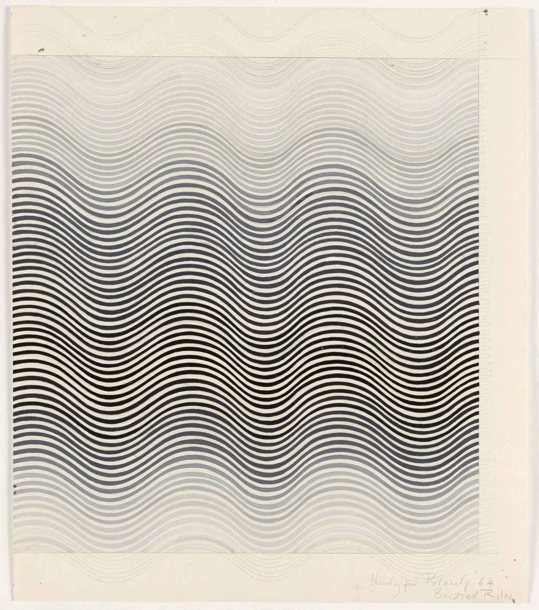

- About this work: [https://hammer.ucla.edu/exhibitions/2023/bridget-riley-drawings-artists-studio](https://hammer.ucla.edu/exhibitions/2023/bridget-riley-drawings-artists-studio)
- BRIDGET RILEY (B. 1931)
- *Study for Polarity*, 1964
- graphite and gouache on paper
- 18 ⅜ × 15 ¾ in. (46.7 × 40 cm)
- Collection of the artist
- Source image: [Hammer Museum](https://hammer.ucla.edu/sites/default/files/styles/large/public/2022-11/BR_Polarity_FR0087_Photo_PC_mm_0.jpg.jpeg)

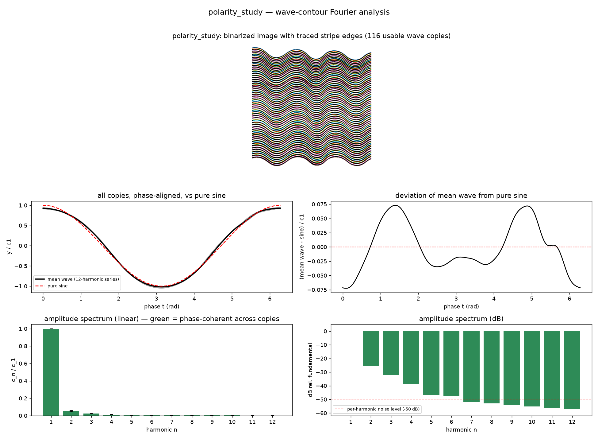

- Usable wave copies: **116** edge curves.
- Mean wavelength λ ≈ 379 px; fundamental amplitude c₁ ≈ 42.7 px;
  peak-to-trough wave height ≈ 32 mm.
- Fitted linear drift: −25.70 px across each copy (−60.2% of c₁), slope
  −0.02252 px/px in y-up coordinates (image-y slope +0.02252).
- **THD (harmonics 2–12): 6.06%** (per copy 4.95–8.28%).
- RMS deviation from the best-fit sine: 3.78 px = 8.86% of the wave
  amplitude; RMS residual of the 12-harmonic fit is 3.31 px = 7.76% of
  amplitude.
- The dominant departures are a 2nd harmonic at 5.3% of the fundamental
  and a 3rd harmonic at 2.5%, both almost perfectly phase-coherent across
  copies. These deviations define a characteristic waveform whose peaks 
  and troughs are subtly flattened and reshaped relative to a pure sine. 
  The same shape consistently recurs throughout the drawing.

Phase-coherent harmonics:

| n | cₙ/c₁ | dB rel. fundamental | ψₙ | phase coherence |
|---|-------|-----|------|------|
| 1 | 1.000 | 0 | 0° | 1.00 |
| 2 | 0.053 ± 0.007 | −25.5 | +178° | 1.00 |
| 3 | 0.025 ± 0.003 | −32.0 | −175° | 1.00 |
| 4 | 0.012 ± 0.002 | −38.6 | −20° | 0.98 |
| 5 | 0.005 ± 0.002 | −46.8 | −120° | 0.85 |
| 6 | 0.004 ± 0.001 | −47.5 | −168° | 0.90 |

---

### *Polarity* (1964, emulsion on canvas)

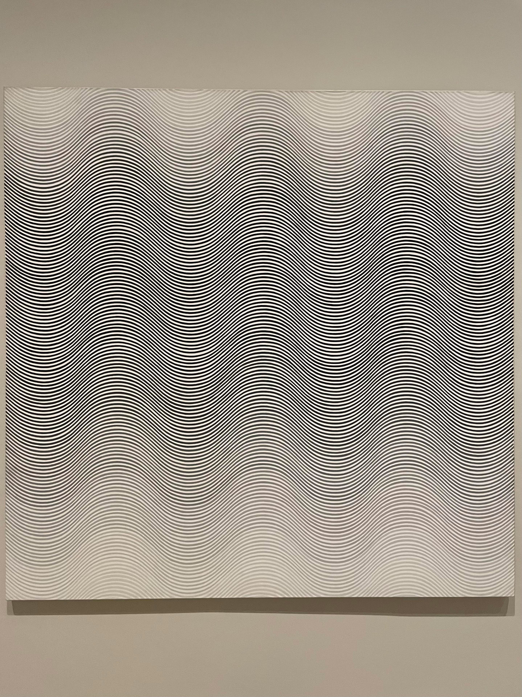

- About this work: [https://collections.lacma.org/object/36063](https://collections.lacma.org/object/36063)
- BRIDGET RILEY (B. 1931)
- *Polarity*, 1964
- emulsion on canvas
- 70 × 70 in. (177.8 × 177.8 cm)
- Los Angeles County Museum of Art, gift of Robert A. Rowan
- Source image: [Reddit mirror](https://www.reddit.com/media?url=https%3A%2F%2Fi.redd.it%2F5xes0dnm21wa1.jpg)

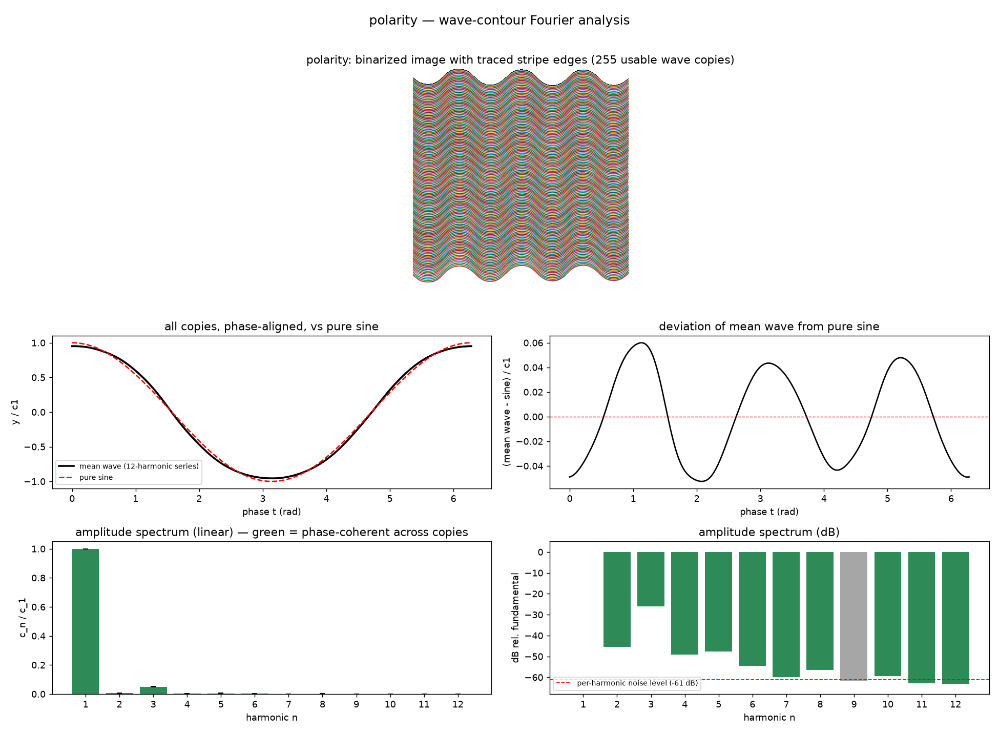

- Usable wave copies: **255** edge curves.
- Mean wavelength λ ≈ 801.1 px; fundamental amplitude c₁ ≈ 104.2 px;
  peak-to-trough wave height ≈ 134 mm.
- Fitted linear drift: +7.79 px across each copy (+7.5% of c₁), slope
  +0.00278 px/px in y-up coordinates (image-y slope −0.00278).
- **THD (harmonics 2–12): 5.06%** (per copy 4.71–5.43%).
- RMS deviation from the best-fit sine: 5.03 px = 4.83% of the wave
  amplitude; RMS residual of the 12-harmonic fit is 3.38 px = 3.24% of
  amplitude.
- The dominant harmonic is a 3rd harmonic at 5.0% of the fundamental,
  with phase coherence 1.00 across the entire painting. This produces a
  characteristic waveform whose crests and troughs are noticeably broader
  than those of a pure sine. The distortion is not only larger than in
  *Cataract 3* or *Gala*; it is also exceptionally consistent, suggesting
  that the painting was constructed using a template with a deliberately
  designed wave-shape rather than an approximate sine.

Phase-coherent harmonics:

| n | cₙ/c₁ | dB rel. fundamental | ψₙ | phase coherence |
|---|-------|-----|------|------|
| 1 | 1.000 | 0 | 0° | 1.00 |
| 2 | 0.005 ± 0.001 | −45.5 | +97° | 0.93 |
| 3 | 0.050 ± 0.002 | −26.0 | −180° | 1.00 |
| 4 | 0.004 ± 0.001 | −49.2 | −141° | 0.98 |
| 5 | 0.004 ± 0.001 | −47.7 | +2° | 0.98 |
| 6 | 0.002 ± 0.001 | −54.5 | +40° | 0.96 |
| 8 | 0.002 ± 0.001 | −56.5 | −138° | 0.95 |
| 10 | 0.001 ± 0.000 | −59.5 | +35° | 0.93 |

Across the two 1964 works, the analysis suggests that Riley was not yet pursuing the near-perfect sinusoidal forms seen in the later curve paintings. Instead, both works employ a distinctive, personal waveform with strong, highly coherent harmonic structure. Whatever construction method generated these curves, it was applied consistently throughout each composition. By 1967, however, Riley's waveforms had become dramatically more sinusoidal, marking a clear shift in both their geometric character as well as their precision.

---

## Citation

If you use this work, please cite the repository using the GitHub
"Cite this repository" button, the metadata in [`CITATION.cff`](CITATION.cff), or this line:

> Levin, G. (2026). *Bridget Riley's Waves: A Harmonic Analysis* [Computer software and research report]. GitHub. [https://github.com/golanlevin/riley_wave_analysis](https://github.com/golanlevin/riley_wave_analysis)

---

<!-- codex resume 019ed265-d3d7-7683-bdc4-b02dad3c8d00 -->